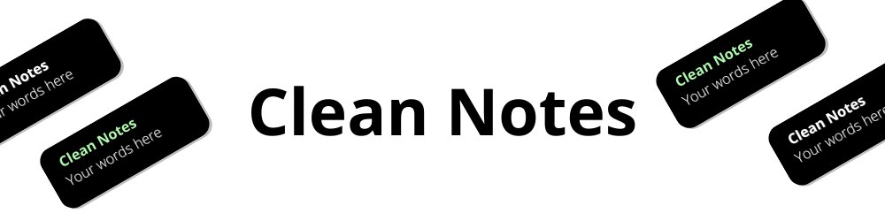
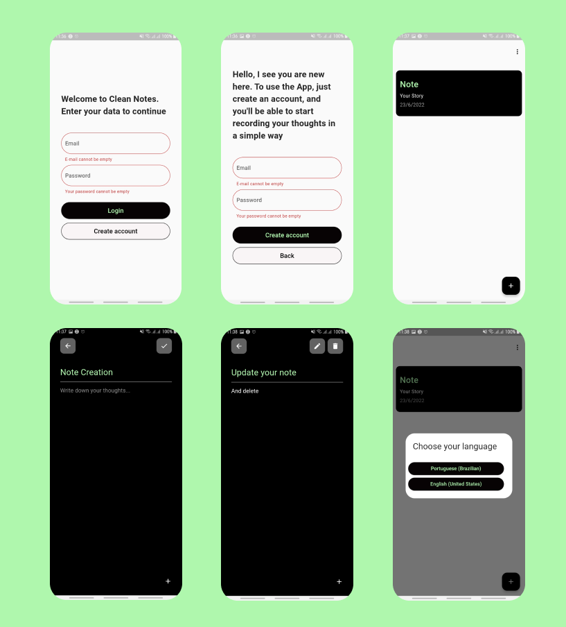

# Clean Notes - A Flutter Notes App

### A Simple Note App for you write your thoughts and guard special memories

 

# Content Table

<!--ts-->

- [Features](#features)
- [Demo](#demo)
- [Technologies](#tech)
- [Author](#author)
- [License](#license)
<!--te-->

 

<h3 align="center">
    ✅ Clean Notes 📝 Finished ✅
</h3>

 

<h2 id="features">Features</h2>

- Login and Register System (Email and Password) Using Firebase Authentication
- Create, Update and Delete Notes
- Notes ordened by date
- Multiple Languages

<h2 id="demo">App Screenshoots and Demo</h2>

<h2 id="tech">Technologies</h2>

- [Dart](https://dart.dev/)
- [Flutter](https://flutter.dev/)
- [Firebase](https://firebase.google.com/?gclsrc=ds&gclid=CJ_x_dLpw_gCFYgnHwodWAsERA&gclsrc=ds)

<h2 id="author">Author</h2>

<a href="#">
	
 	 
	<b>Jackson Monteiro</b></a> 
 </a>

Made by Jackson Monteiro. let's talk!

<h2 id="license">
    LICENSE
</h2>

